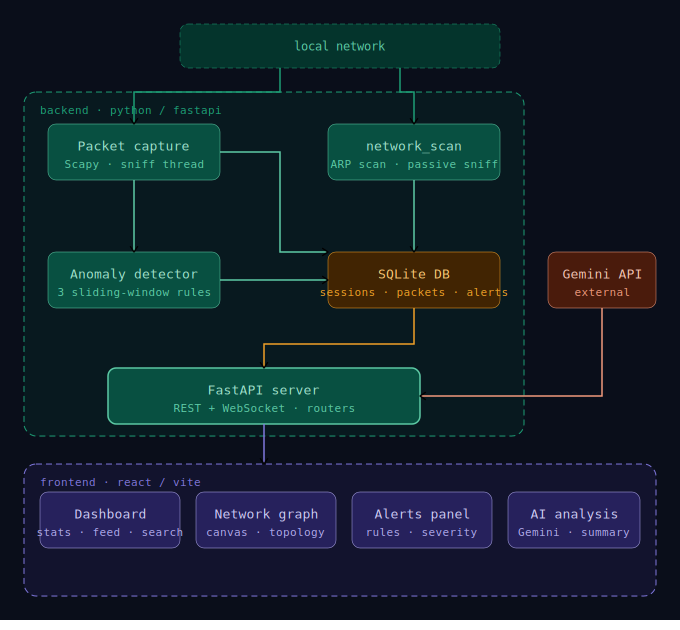

# NETAnalyzer

A Python-based network traffic analyzer that captures live packets, stores them in a SQLite database, and displays real-time stats through a React web dashboard.  
Built with **Scapy**, **FastAPI**, and **React + Vite**.

---

## 📚 Table of Contents

<details>
<summary>Click to expand</summary>

- [Overview](#netanalyzer)
- [Features](#-features)
- [Requirements](#-requirements)
- [Project Structure](#️-project-structure)
- [Installation](#-installation)
  - [Backend](#backend)
  - [Frontend](#frontend)
- [Usage](#️-usage)
- [Running the App](#-running-the-app)
  - [Dev Mode](#dev-mode--two-processes-two-ports)
  - [Prod Mode](#prod-mode--one-process-one-port)
- [Configuration](#-configuration)
- [Architecture Overview](#️-architecture-overview)
- [Disclaimer](#️-disclaimer)
- [Credits](#-credits)

</details>

## ✨ Features
 
| Feature | Description |
|---------|-------------|
| **Live packet capture** | Captures packets off the wire using Scapy, stores every packet in SQLite in real time |
| **Dashboard** | Metric cards, top-10 IPs by traffic, protocol breakdown (donut chart), live packet feed |
| **Packet search** | Full-text and per-field filtering across all packets in a session |
| **Network map** | Canvas-based device diagram built from ARP — router at centre, devices on a ring, edge thickness proportional to traffic |
| **Anomaly detection** | Three rule-based detectors running on every packet: suspicious port, high-volume flood, port scan |
| **AI analysis** | Gemini-powered session summary and per-alert explanations via the AI Analysis panel (user provides API key) |
| **Session management** | Multiple named sessions, each isolated in the DB; export to CSV or Excel |
| **Dev/prod modes** | Dev: Vite on :5173 + FastAPI on :8000. Prod: `npm run build` → FastAPI serves everything on :8000 |
 

---

## ⚙️ Requirements

- Python 3.11+
- Node.js 20+
- **Npcap** installed in *WinPcap compatibility mode* (Windows only)
- Run the backend terminal as **Administrator** (required for raw-socket capture)

---


## 🗂️ Project Structure
<details>
<summary>Click to expand</summary>

```
├── assets
│   └── architecture.svg
├── backend
│   ├── core
│   │   ├── config.py
│   │   └── state.py
│   ├── db
│   │   ├── __init__.py
│   │   ├── alerts.py
│   │   ├── devices.py
│   │   ├── models.py
│   │   ├── packets.py
│   │   └── sessions.py
│   ├── routers
│   │   ├── ai_analysis.py
│   │   ├── capture.py
│   │   ├── network.py
│   │   ├── sessions.py
│   │   └── websocket.py
│   ├── services
│   │   ├── anomaly.py
│   │   ├── capture.py
│   │   ├── export.py
│   │   ├── network_scan.py
│   │   ├── stats.py
│   │   └── topology.py
│   ├── .env.example
│   ├── main.py
│   └── requirements.txt
├── frontend
│   ├── public
│   │   └── favicon.svg
│   ├── src
│   │   ├── api
│   │   │   └── client.js
│   │   ├── components
│   │   │   ├── alerts
│   │   │   │   ├── AlertsPanel.jsx
│   │   │   │   └── AlertsPanel.module.css
│   │   │   ├── analysis
│   │   │   │   ├── AiAnalysis.jsx
│   │   │   │   └── AiAnalysis.module.css
│   │   │   ├── dashboard
│   │   │   │   ├── Dashboard.jsx
│   │   │   │   ├── Dashboard.module.css
│   │   │   │   ├── MetricsCards.jsx
│   │   │   │   ├── MetricsCards.module.css
│   │   │   │   ├── PacketFeed.jsx
│   │   │   │   ├── PacketFeed.module.css
│   │   │   │   ├── PacketSearch.jsx
│   │   │   │   ├── PacketSearch.module.css
│   │   │   │   ├── ProtocolBreakdown.jsx
│   │   │   │   ├── ProtocolBreakdown.module.css
│   │   │   │   ├── TopIps.jsx
│   │   │   │   └── TopIps.module.css
│   │   │   ├── layout
│   │   │   │   ├── NavBar.jsx
│   │   │   │   ├── NavBar.module.css
│   │   │   │   ├── SessionBar.jsx
│   │   │   │   ├── SessionBar.module.css
│   │   │   │   ├── TopBar.jsx
│   │   │   │   └── TopBar.module.css
│   │   │   ├── network
│   │   │   │   ├── NetworkGraph.jsx
│   │   │   │   └── NetworkGraph.module.css
│   │   │   └── ui
│   │   │       ├── ProtoBadge.jsx
│   │   │       ├── ProtoBadge.module.css
│   │   │       ├── Toast.module.css
│   │   │       ├── ToastContainer.jsx
│   │   │       └── ToastContext.jsx
│   │   ├── constants
│   │   │   ├── colors.js
│   │   │   └── protocols.js
│   │   ├── utils
│   │   │   └── format.js
│   │   ├── App.jsx
│   │   ├── App.module.css
│   │   ├── index.css
│   │   └── main.jsx
│   ├── eslint.config.js
│   ├── index.html
│   ├── package-lock.json
│   ├── package.json
│   └── vite.config.js
├── .gitattributes
├── .gitignore
└── README.md
```

</details>

---

## 📦 Installation

### Backend

```bash
cd backend
pip install -r requirements.txt
```

### Frontend

```bash
cd frontend
npm install
```

---

## 🖥️ Usage

### First-time setup
1. Start the backend and frontend (see [Running the App](#-running-the-app))
2. Open the app and create a **named session** using the session bar at the top — each capture run lives in its own isolated session
3. Click **⟳ scan** in the Network tab to discover devices on your `/24` subnet before capturing — this populates the network map
4. Return to the Dashboard tab and click **▶ start** to begin capturing packets
5. Click **■ stop** when done — stats, alerts, and the device snapshot are all persisted to the session

### Sessions
Each capture runs inside a named session. Sessions are write-once — you can't add more packets to a finished session, but you can create as many sessions as you like and switch between them freely to compare captures. Export any session to CSV or Excel from the session bar.

### Network map
The map is built from ARP traffic. Run a manual scan before capturing to get an immediate snapshot, or let the passive sniffer discover devices naturally during capture. The router is placed at the centre (detected by `.1` IP or known manufacturer); all other devices sit on a ring. Node size and edge thickness scale with traffic volume.

### Scan vs capture
Run the **scan first**, then **capture**. The scan sends active ARP requests to populate the map upfront. Once capture starts, a passive ARP sniffer runs alongside packet capture to catch any devices that appear later — but it won't send any packets itself.

### AI analysis
Navigate to the **AI Analysis** tab and enter a [Google Gemini API key](https://aistudio.google.com/apikey) (free tier is sufficient). You can generate a summary of the full session or request an explanation of any individual alert. The key is stored in your browser only and is never sent anywhere except your local backend.

---

## ▶️ Running the App

### DEV mode — two processes, two ports

Best for active development: Vite's hot-reload works and API errors show full traces.

```bash
# Terminal 1 – API (port 8000), must be run as Administrator
cd backend
uvicorn main:app --reload

# Terminal 2 – UI (port 5173)
cd frontend
npm run dev
```

Open **http://localhost:5173**.  
Vite automatically proxies all API calls to `localhost:8000`, so there are no CORS issues and no manual URL config needed.

---

### PROD mode — one process, one port

Build the frontend once; FastAPI serves everything on port 8000.

```bash
# Step 1 – build the React app into backend/static/
cd frontend
npm run build

# Step 2 – start the server (must be run as Administrator)
cd backend
uvicorn main:app --host 0.0.0.0 --port 8000
```

Open **http://localhost:8000** (or your machine's LAN IP on port 8000).  
No Vite, no CORS config, no second terminal.

---

## 🔧 Configuration

Copy `backend/.env.example` to `backend/.env` and edit as needed:

| Variable           | Default                        | Description |
|--------------------|-------------------------------|-------------|
| `DB_PATH`          | `../netanalyzer.db`           | SQLite file location |
| `CAPTURE_INTERFACE`| `Wi-Fi`                       | NIC name for Scapy (`Ethernet`, `eth0`, `en0`, …) |
| `CORS_ORIGINS`     | `http://localhost:5173`       | Dev-only: allowed CORS origins |
| `GEMINI_API_KEY`   | *(blank)*                     | Optional: Google Gemini key for AI analysis |

The frontend respects a `VITE_API_URL` env var if the backend is on a remote host:

```bash
# frontend/.env.local
VITE_API_URL=http://192.168.1.10:8000
```

---

## 🏗️ Architecture Overview

<div style="text-align: center;">
    
</div>

**High-level Description**
- **Backend (FastAPI + Scapy):** Captures packets, runs anomaly detection, stores packets and alerts in SQLite, serves REST API and WebSocket streams.  
- **AI Analysis Service (Gemini):** Consumes session data via API for insights and summaries.  
- **Frontend (React + Vite):** Displays dashboards, network map, live packet feed, anomaly alerts, and AI analysis.  
- **Database (SQLite):** Stores packets, sessions, devices, and alerts; supports both direct writes from packet capture and detector-generated alerts.  
- **Communication:** WebSocket streams live stats and alerts; HTTP API handles queries, session management, and AI requests.
> **Subnet note:** network_scan assumes a /24 subnet, derived automatically from the machine's local IP. This covers the vast majority of home and small office networks.

--- 

---

## ⚠️ Disclaimer

This tool is built for use on networks you own or have explicit permission to monitor.  
Packet capture on networks without authorisation is illegal.  
This project is developed and tested on a personal home network only.

---

## 🙌 Credits

**Developed by [Emily](https://github.com/emiHuy)**

Built with [Scapy](https://scapy.net/), [FastAPI](https://fastapi.tiangolo.com/), and [React](https://react.dev/).  
Network manufacturer lookup via [manuf](https://github.com/coolbho3k/manuf).  
Charts via [Recharts](https://recharts.org/).  
AI analysis powered by [Google Gemini](https://aistudio.google.com/).