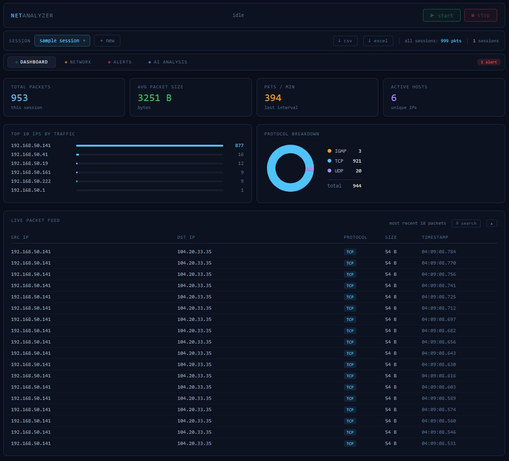
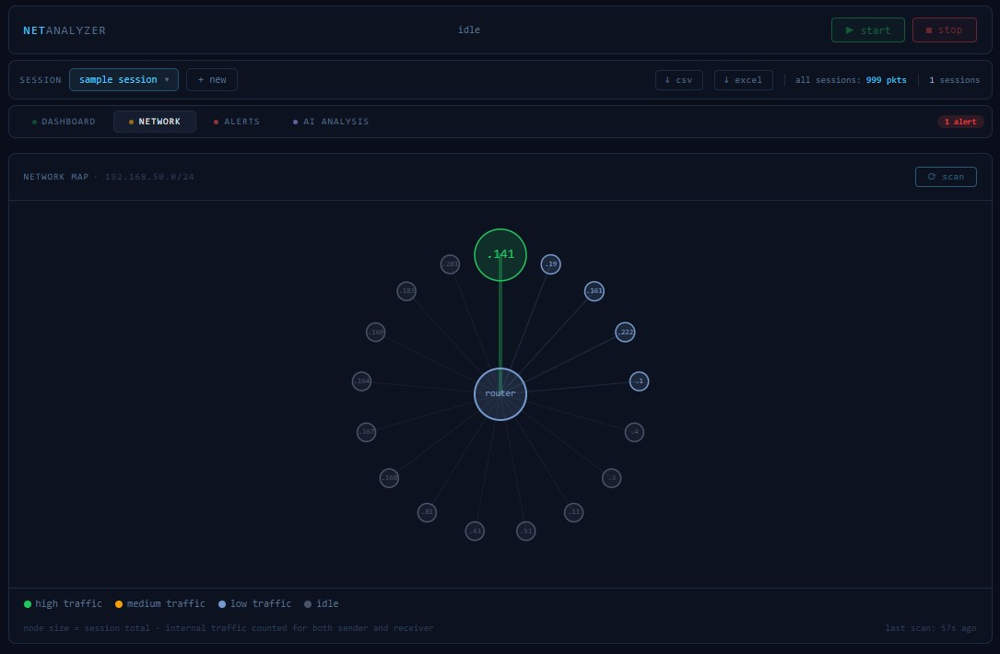
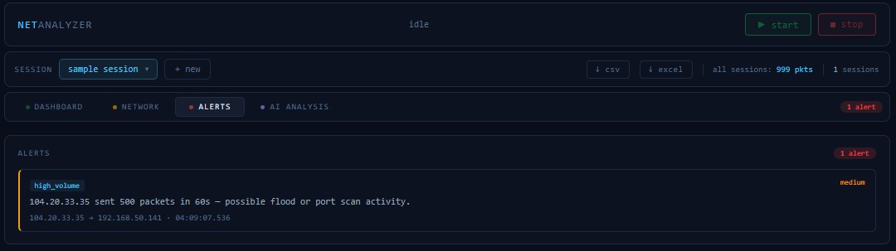
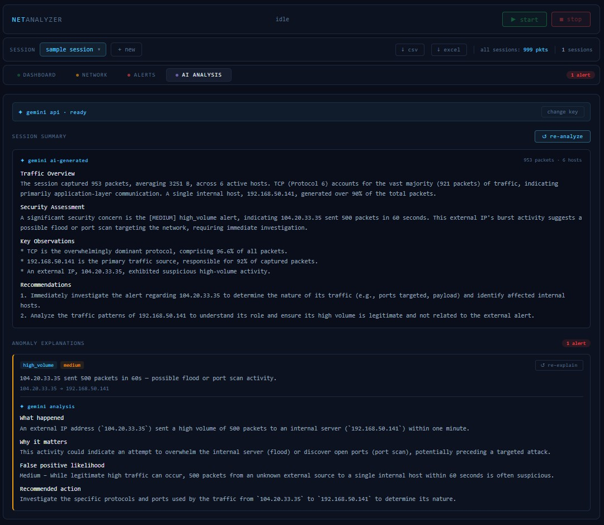

# NETAnalyzer 

A live network packet capture and analysis tool — built with **Scapy**, **FastAPI**, and **React**.

---

## ✨ Features

| Feature | Description |
|---------|-------------|
| **Live capture** | Scapy sniffs packets off the wire and stores them in SQLite in real time |
| **Dashboard** | Metric cards, top-10 IPs, protocol donut chart, live packet feed |
| **Packet search** | Global and per-field filtering across all packets in a session |
| **Network map** | Canvas-based ARP topology — router at centre, devices on a ring, edges scale with traffic |
| **Anomaly detection** | Three sliding-window rules: suspicious port, high-volume flood, port scan |
| **AI analysis** | Gemini-powered session summary and per-alert explanations |
| **Session management** | Multiple named sessions, isolated in the DB; export to CSV or Excel |

---

## 📸 Screenshots

<h3 align="center">Dashboard</h3>
<p align="center">
  
</p>

<h3 align="center">Network Map</h3>
<p align="center"><em>Post-capture topology — node size scales with total traffic, router auto-detected at centre</em></p>
<p align="center">
  
</p>

<h3 align="center">Alerts</h3>
<p align="center">
  
</p>

<h3 align="center">AI Analysis</h3>
<p align="center">
  
</p>
---

## ⚙️ Requirements

- **Npcap** installed in WinPcap compatibility mode (Windows)
- Python 3.11+
- Node.js 20+ *(dev only)*
- Run as **Administrator** — Scapy needs raw socket access

---

## ⬇️ Download

Grab the latest release from [Releases](../../releases) — no Python or Node required.

1. Download and extract `NETAnalyzer.zip`
2. Run `NETAnalyzer.exe` **as Administrator**
3. The app opens in your browser at `http://localhost:8000`
4. A tray icon appears in the system tray — right-click → **Quit** to exit

> If the tray icon isn't visible, click the `^` arrow in the bottom-right taskbar corner to reveal hidden icons.

---

## 🚀 Usage

1. **Create a session** — give it a name in the session bar at the top
2. **Scan** — go to the Network tab and click ⟳ scan to discover devices on your `/24` subnet
3. **Capture** — go back to Dashboard and click ▶ start
4. **Stop** — click ■ stop when done; stats, alerts, and the device snapshot are saved to the session

Sessions are write-once — once a capture is complete you can't add to it, but you can create as many sessions as you like and compare them freely.

**AI analysis** — go to the AI Analysis tab and enter a [Gemini API key](https://aistudio.google.com/apikey) (free tier works). The key is stored in your browser only.

---

## 🛠️ Dev Setup

### Backend
```bash
cd backend
pip install -r requirements.txt
```

### Frontend
```bash
cd frontend
npm install
```

### Running in dev mode
```bash
# Terminal 1 — API (run as Administrator)
cd backend
uvicorn main:app --reload

# Terminal 2 — UI
cd frontend
npm run dev
```

Open **http://localhost:5173**. Vite proxies API calls to port 8000 automatically.  
👉 API endpoints available at **http://localhost:8000/docs**.

### Running in prod mode
```bash
cd frontend && npm run build
cd ../backend && uvicorn main:app --host 0.0.0.0 --port 8000
```

Open **http://localhost:8000**.

---

## 📦 Building the Executable

```bash
pip install pyinstaller pillow pystray
python build.py
```

Output: `dist/NETAnalyzer/NETAnalyzer.exe`. Ship the entire `dist/NETAnalyzer/` folder.

> `build.py` handles everything: icon generation, frontend build, spec file, and PyInstaller.

---

## 🔧 Configuration

Copy `backend/.env.example` to `backend/.env`:

| Variable | Default | Description |
|---|---|---|
| `DB_PATH` | `../netanalyzer.db` | SQLite file location |
| `CAPTURE_INTERFACE` | `Wi-Fi` | NIC name (`Ethernet`, `eth0`, `en0`, …) |
| `CORS_ORIGINS` | `http://localhost:5173` | Dev-only CORS origins |
| `GEMINI_API_KEY` | *(blank)* | Optional server-side Gemini key |

---

## 🏗️ Architecture

<p align="center">
    
</p>

**Stats** are computed via SQL on the packet table — no in-memory aggregation — so they're accurate and survive restarts. The exception is per-device counters (`bytes_seen`, `packet_count`, `last_seen`), which are maintained in memory during capture and flushed to the DB on stop.

---

## 🔍 How It Works

### Packet capture
Scapy's `sniff()` runs in a background daemon thread. Each IP packet is extracted, written to SQLite, updates per-device counters, and runs through the anomaly detector. Non-IP frames, broadcasts, and multicasts are dropped.

### Network map
Two ARP mechanisms run in parallel — an active scan (ARP broadcast to the /24 subnet, ~2s) run before capture starts, and a passive sniffer that listens during capture without sending any packets. The router is identified by `.1` IP suffix or known manufacturer.

### Anomaly detection

| Rule | Trigger | Severity |
|---|---|---|
| `suspicious_port` | Traffic to ports associated with malware (4444, 6667, 31337, …) | High |
| `high_volume` | Single source ≥ 500 packets in 60s | Medium |
| `port_scan` | Single source probes ≥ 20 unique ports on one host in 60s | High |

Alerts are persisted immediately and streamed to the frontend via WebSocket as toast notifications.

---

## 🧭 Roadmap

- **Exclude observer device** — option to filter the capture machine's own IP from the network map and stats
- **Optional settings** — configurable packet feed limit, detection thresholds, and subnet range in the UI without touching code
- **Better detection engine** — Z-score baseline comparison and lightweight ML (isolation forest or similar) to reduce false positives on busier networks; per-host rolling baselines instead of global fixed thresholds
- **Timeline navigation** — brushable packets-per-minute chart so you can scrub to any point in a session
- **DNS resolution** — reverse-lookup IPs to show hostnames
- **Geo-IP** — flag external IPs with country data

---

## ⚠️ Disclaimer

For use on networks you own or have explicit permission to monitor. Packet capture without authorisation is illegal.

---

## 🙌 Credits

**Developed by [Emily](https://github.com/emiHuy)**

Built with [Scapy](https://scapy.net/), [FastAPI](https://fastapi.tiangolo.com/), and [React](https://react.dev/).  
Network manufacturer lookup via [manuf](https://github.com/coolbho3k/manuf).  
Charts via [Recharts](https://recharts.org/).  
AI analysis powered by [Google Gemini](https://aistudio.google.com/).

---

## License

This project is licensed under the [MIT License](LICENSE).
